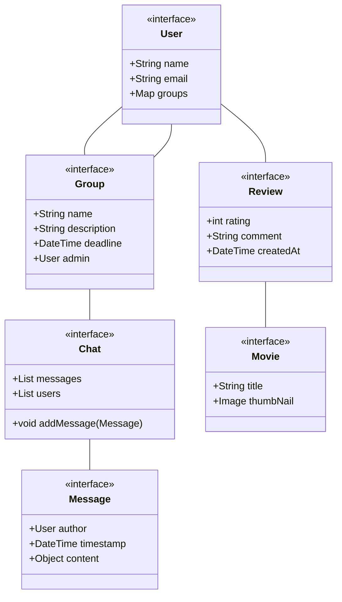
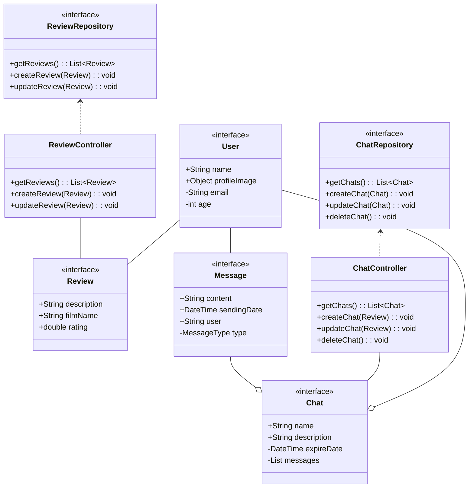
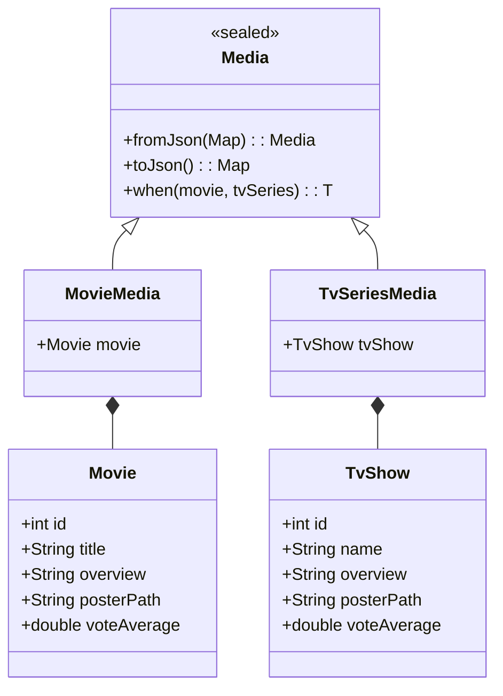
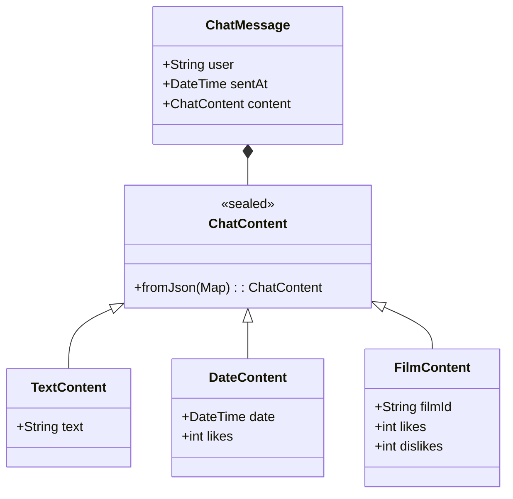
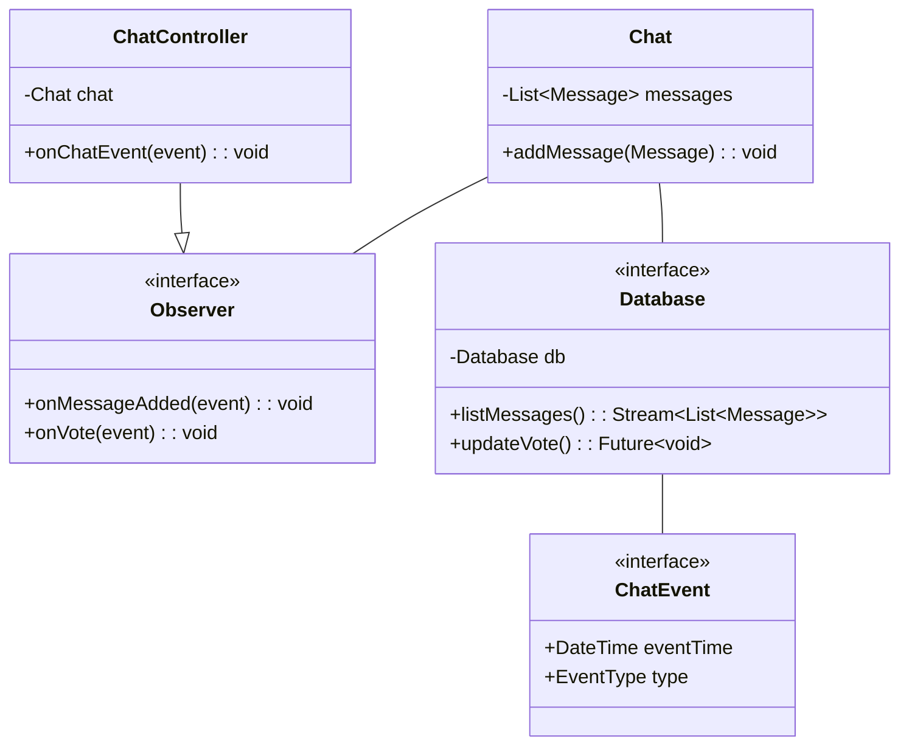

# Relazione di progetto

Prodotto da: 

Potenza Vito Paolo 

Zappoli Giorgio

**Corso di Tecnologie dei Sistemi Informatici Imola**

# Analisi

**CineNight** è un'applicazione mobile che consente agli utenti di esprimere la propria passione per il cinema, condividere recensioni e organizzare serate a tema. L'app integra un sistema di chat con gestione di film ad hoc, integrando interazioni in tempo reale tra gli utenti partecipanti.

## Requisiti

L'app in questione deve permettere agli utenti di poter aggiungere delle recensioni ad una lista personale, così da poter tenere traccia dei film visti e delle loro valutazioni. Inoltre deve anche permettere la gestione di camere testuali dove gli utenti possono organizzare serate a tema cinema, rendendo più semplice la scelta di un film e di una data adottando un sistema di valutazione interno.

### Requisiti Funzionali

- **Autenticazione**: Gli utenti possono registrarsi, effettuare il login e modificare il proprio profilo personale.

- **Sistema di Recensioni**: Gli utenti possono creare, leggere, modificare ed eliminare recensioni di film e serie TV.

- **Canali testuali**: Gli utenti possono creare gruppi per organizzare serate a tema cinema. All'interno di ogni gruppo è presente una chat in tempo reale dove l'organizzatore può proporre date per la serata e dove gli utenti possono proporre film.

- **Sistema di votazione**: Integrazione di sistema di votazione all'interno di ogni gruppo, con funzionalità di "mi piace" e "non mi piace" sulle proposte degli utenti.

### Requisiti Non Funzionali

- Le recensioni, chat e messaggi dovranno aggiornarsi in tempo reale, rendendo l'esperienza interattiva per gli utenti.

- L'applicazione deve supportare almeno italiano e inglese, adattandosi automaticamente alla lingua del dispositivo.

- L'app deve permettere di cambiare tema tra chiaro e scuro.

## Analisi e Modello del Dominio

All'interno del dominio di CineNight sono individuabili tre attori principali: **Utenti**, **Recensioni** e **Gruppi**. Un utente può creare ed essere membro di più gruppi e, allo stesso tempo, può anche creare recensioni su film che ha visto. Ogni gruppo contiene una chat dove gli utenti si scambiano messaggi e proposte di film fino a che non si ha scelto un film per terminare il gruppo. Questo avverrà in modo democratico in base al maggior numero di votazioni positive ottenute.

### Entità Principali e Relazioni

Un utente potrà creare una recensione su un qualsiasi film o serie TV che ha visto. Inoltre, gli utenti potranno creare camere testuali dove sarà possibile parlare con tutti gli altri utenti facenti parte di quest'ultima. Ogni membro potrà suggerire un film e allo stesso tempo votare per tutte le altre proposte.

### Schema UML del Dominio



### Aspetti Critici del Dominio

Il dominio richiede un sistema di votazione a due fasi con scadenze diverse per permettere di votare in una prima fase per la data, e in una seconda per il film. Questo rappresenta una complessità nel gestire lo stato della votazione e le transizioni tra fasi.

Le chat e i sistemi di votazione devono sincronizzarsi in tempo reale tra i vari utenti in un gruppo. Questo comporta sfide di consistenza dei dati e di aggiornamento dell'interfaccia grafica.

Le recensioni devono essere condivisibili tramite link personalizzati.

# Design

## Architettura

L'architettura di CineNight segue il pattern **MVVM (Model-View-ViewModel)**, effettuando una divisione netta tra la logica applicativa e le *viste* utente. Sono presenti principalemnte tre controller, uno per ogni funzionalità dell'applicazione. Ogni utente viene amministrato da un controller che ne gestisce i dati fondamentali, a sua volta ogni utente potrà gestire tutte le recensioni che ha creato, le quali sono classi a se stanti controllate a loro volta da un apposito controller. Allo stesso tempo l'utente potrà creare e modificare dei gruppo di utenti, o anche solo farne parte. Questi hanno, oltre a un controller, un **Observer** che ne garantisce la reattività, applicando pattern ad eventi per la sincronizzazione multipla di utenti e messaggi.

### Componenti Principali




## Design dettagliato

### Film e serie Tv come oggetti

La rappresentazione di film o serie Tv ha richiesto il passaggio da diverse idee di design per arrivare ad avere quella che è stata poi scelta come idea principale. Inizialmente un approccio diretto, avendo due classi ben distinte tra loro, ha portato ad evidenziare come le due fosse molto simili, portando ad elaborare un approccio che permettesse di applicare il principio del *Polimorfismo* per risolvere questo problema.



#### Soluzione

Questo approccio ha prodotto un modello che, applicando il pattern **Discriminated Union**, ha permesso di poter gestire entrambi i tipi di Media. In aggiunta, è stato anche utilizzato il **Factory** pattern per la sostituzione del metodo costruttore con una *Factory* che ne gestisce la creazione e sceglie quale dei due oggetti istanziare.

### Messaggi all'interno di una chat

Uno dei problemi principali sorti in fase di progettazione è stato quello della gestione di tipi diversi di messaggi. Nello specifico, all'interno di una chat ci sono tre principali tipologie di messaggi che possono essere inviati dagli utenti. La scelta di realizzare una classe `ChatMessage` che permetta la distinzione di tipo tra le tre categorie, quindi una per i messaggi di tipo meramente *testuale*, una per le *proposte di date* e una per *proporre film* è stata effettuata andando nuovamente ad implementare il **Discriminated Union** pattern, permettendo in modo più stretto il controllo di queste classi.



### Gestione messaggi in una chat

Avendo la necessità di ridurre il più possibile il tempo necessario per la ricezione dei messaggi il più grande problema è stata la gestione dei messaggi all'interno delle chat. L'applicazione di **Observer** pattern ai controller permette di poter gestire la chiamate di eventi che ne scaturiscono l'aggiornamento.



#### Soluzione

L'*Observer* pattern permette di rispondere velocemente ai cambiamenti del sistema all'interno di una chat, gestendo eventi che vengono scaturiti direttamente dalla sorgente o, come in questo caso, dal database. 

# Sviluppo

## Testing

Durante lo sviluppo sono state utilizzate tecniche di testing automatico per poter effettuare sviluppo tests driven, ma solo sulla logica implementativa e non sulla UI. In questo caso sono stati utilizzati due tipi di test, ovvero **Test unitari e di integrazione**

### Testing Unitario

Test unitari sono stati scritti per permettere la validazione di modelli verificando che i modelli siano coerenti con i dati attesi in ricezione, testando il funzionamento dei DTO e delle API.

**Esempio di test unitario**:

```dart
void main() {
  late TmdbApi api;

  setUp(() {
    api = TmdbApi();
  });
    test('Should be able to fetch a media given its name', () async     {
        final List<Media> res = await api.getMultiMediaByName(
          name: 'Django Unchained',
          language: AppLocalizationsIt().requestApiLanguage,
        );

        final Media media = res.elementAt(0);
        expect(
          media.when(
            movie: (Movie movie) => movie.title,
            tvSeries: (TvShow tvSeries) => tvSeries.name,
          ),
          'Django Unchained',
        );

        debugPrint(media.toString());
      });
}
```

L'esecuzione di test con la suite integrate di Flutter ha permesso di poter ottenere un mapping adeguato tra gli oggetti effettivi ricevuti dall'API e il modello aspettato.

### Testing di Integrazione

I test di integrazione hanno permesso di poter effettuare verifiche mirate su flussi specifici, andando a mettere alla prova più componenti tra di loro. Questi hanno permesso di testare le dipendenze reali, i database, l'accesso utete e anche le API, così da permettere il controllo e, naturalmente, la risoluzione di problemi comportamentali tra i vari componenti.

**Esempio di test di integrazione**:

```dart
testWidgets('Should list reviews for a user and then cancell them all', (
      WidgetTester tester,
    ) async {
      final String userId = 'test_${idGen.v4()}';

      final UserProfile newUser = UserProfile(
        age: 24,
        firstLastName: 'Andrea Rossi',
        userId: userId,
      );

      await userProfileRepository.createUser(newUser);

      final String reviewId = 'test_${idGen.v4()}';

      final Review newReveiw = Review(
        userId: userId,
        reviewId: reviewId,
        filmId: "1234",
        type: ReviewItemType.movie,
        description: "Description for test review",
        rating: 4,
        filmName: "Mock film name",
        lowercaseName: "mock film name",
      );

      await reviewRepository.createReview(newReveiw);

      final String review2Id = 'test_${idGen.v4()}';

      final Review newReveiw2 = Review(
        userId: userId,
        reviewId: review2Id,
        filmId: "234",
        type: ReviewItemType.movie,
        description: "Description for test review 2",
        rating: 7,
        filmName: "Mock film name",
        lowercaseName: "mock film name",
      );

      await reviewRepository.createReview(newReveiw2);

      final List<Review> listedReviews = await reviewRepository.listReviews(
        userId,
      );

      expect(listedReviews.length, 2);

      await userProfileRepository.deleteUserProfile(userId);
      await reviewRepository.deleteReview(reviewId);
      await reviewRepository.deleteReview(review2Id);
    });
```

---

## Note di Sviluppo

### Utilizzo Stream per i messaggi

Permalink: https://github.com/VitoSpritz/cinemaNight/blob/dev/lib/repositories/chat_message_repository.dart

#### Snippet

```dart
Stream<List<ChatMessage>> watchMessages({
    required String chatId,
    int pageSize = 50,
  }) {
    return _firestore
        .collection('chats')
        .doc(chatId)
        .collection('messages')
        .orderBy('sent_at', descending: true)
        .limit(pageSize)
        .snapshots()
        .map((QuerySnapshot<Map<String, dynamic>> snapshot) {
          return snapshot.docs
              .map(
                (QueryDocumentSnapshot<Map<String, dynamic>> doc) =>
                    ChatMessage.fromJson(doc.data()),
              )
              .toList();
        });
  }
```
#### Descrizione

Applicazione di **Stream** per la ricezione dei messaggi all'interno di una chat. Nello specifico, utilizzando gli *Snapshot* offerti da Flutter per la gestione di eventi ottenuto dal database.

### Deep linking

Permalink: https://github.com/VitoSpritz/cinemaNight/blob/dev/lib/providers/deep_link.dart

#### Snippet

```dart
@Riverpod(keepAlive: true)
AppLinks appLinks(Ref ref) {
  return AppLinks();
}

@Riverpod(keepAlive: true)
Stream<void> deepLinkListener(Ref ref) async* {
  final AppLinks appLinks = ref.watch(appLinksProvider);

  await Future<void>.delayed(const Duration(milliseconds: 800));

  final Uri? initialUri = await appLinks.getInitialLink();
  if (initialUri != null && initialUri.host.isNotEmpty) {
    handleDeepLink(initialUri);
  }

  appLinks.uriLinkStream.listen((Uri uri) {
    if (uri.host.isNotEmpty) {
      handleDeepLink(uri);
    }
  });
}

void handleDeepLink(Uri uri) {
  final BuildContext? context = GlobalState.navigatorKey.currentContext;
  if (context == null) {
    return;
  }

  final GoRouter router = GoRouter.of(context);

  if (uri.host == 'review' && uri.pathSegments.length >= 2) {
    final String reviewId = uri.pathSegments[0];
    router.goNamed(
      'reviewInfo',
      pathParameters: <String, String>{'reviewId': reviewId},
    );
  }
}
```

#### Descrizione

Questo provider gestisce i deep link dell'applicazione, permettendo di aprire l'app direttamente su una schermata specifica tramite URL (es. cinemanight://review/123).
All'avvio controlla se l'app è stata aperta tramite un deep link (getInitialLink), poi si mette in ascolto continuo. Quando la funzione getInitialLink rileva che l'applicazione è stata aperta da un URI valido la funzione **handleDeepLink** apre la recensione corrispondente se presente.


### Gestione dinamica dei temi

Permalink: https://github.com/VitoSpritz/cinemaNight/blob/dev/lib/helpers/app_palette.dart

#### Snippet

```dart
class AppPalette {
  AppPalette._(this.context) {
    final Brightness brightness = Theme.of(context).brightness;
    isDarkMode = (brightness == Brightness.dark);

    textColors = _TextColors(isDarkMode);
    backgroudColor = _BackgroudColor(isDarkMode);
    badgeColor = _BadgeColor(isDarkMode);
    messageBackgroundColor = _MessageBackground(isDarkMode);
    pickerTheme = _PickerTheme(isDarkMode);
  }

  static AppPalette of(BuildContext context) {
    return AppPalette._(context);
  }

  final BuildContext context;
  late final bool isDarkMode;

  late final _TextColors textColors;
  late final _BackgroudColor backgroudColor;
  late final _BadgeColor badgeColor;
  late final _MessageBackground messageBackgroundColor;
  late final _PickerTheme pickerTheme;
}

class _PickerTheme {
  _PickerTheme(this.isDarkMode);

  final bool isDarkMode;

  ColorScheme get colorScheme => isDarkMode
      ? const ColorScheme.dark(
          primary: CustomColors.lightBlue,
          onPrimary: CustomColors.white,
          onSurface: CustomColors.white,
        )
      : const ColorScheme.light(
          primary: CustomColors.lightBlue,
          onPrimary: CustomColors.white,
          onSurface: CustomColors.black,
        );
}
```

#### Descrizione

La classe statica **AppPalette** permette il riutilizzo dei colori richiamando in modo statico le classi dei colori, specificando i singoli tramite i getter che li gestiscono in modo autonomo basandosi sul tema specificato dall'utente.

### File di ambiente

Permalink: https://github.com/VitoSpritz/cinemaNight/blob/dev/lib/env/env.dart

#### Snippet

```dart
import 'package:envied/envied.dart';

part 'env.g.dart';

@Envied(path: '.env')
abstract class Env {
  @EnviedField(varName: "TOKEN", obfuscate: true)
  static final String token = _Env.token;

  @EnviedField(varName: "API_KEY", obfuscate: true)
  static final String apiKey = _Env.apiKey;

  @EnviedField(varName: "BASE_URL", obfuscate: true)
  static final String baseUrl = _Env.baseUrl;

  @EnviedField(varName: "FIRESTORE_URL", obfuscate: true)
  static final String firestoreUrl = _Env.firestoreUrl;
}
```

#### Descrizione

Classe astratta che permette la gestione delle variabili di ambiente quali Token e API key, assicurando la segretezza di queste ultime, non esponendole direttamente all'interno del codice.

### Classi helper con pattern matching

Permalink: https://github.com/VitoSpritz/cinemaNight/blob/dev/lib/helpers/media_converter.dart

```dart
class MediaConverter {
  static getValue({required Media media, required MediaField field}) {
    switch (field) {
      case MediaField.id:
        return media.when(
          movie: (Movie movie) => movie.id,
          tvSeries: (TvShow tvSeries) => tvSeries.id,
        );
      case MediaField.poster:
        return media.when(
          movie: (Movie movie) => movie.posterPath,
          tvSeries: (TvShow tvSeries) => tvSeries.posterPath,
        );
        ...
        }
    }
}
```

#### Descrizione

Questa classe helper permette di applicare pattern matching sulla classe *Media* per poter estrerre in modo *type-safe* qualsiasi attributo andando a richimare la funzione statica e il campo da ottenere.

### Gestione avanzata del routing

Permalink: https://github.com/VitoSpritz/cinemaNight/blob/dev/lib/screens/router/router.dart


```dart
...
StatefulShellRoute.indexedStack(
        builder:
            (
              Object? context,
              GoRouterState state,
              StatefulNavigationShell navigationShell,
            ) {
              return CustomBottomBar(navigationShell: navigationShell);
            },
        branches: <StatefulShellBranch>[
          StatefulShellBranch(
            navigatorKey: _shellNavigatorAKey,
            routes: <RouteBase>[
              GoRoute(
                path: Account.path,
                builder: (BuildContext context, GoRouterState state) =>
                    const Account(),
              ),
            ],
          ),
          StatefulShellBranch(
            routes: <RouteBase>[
              GoRoute(
                path: ReviewList.path,
                builder: (BuildContext context, GoRouterState state) =>
                    const ReviewList(),
              ),
            ],
          ),
          StatefulShellBranch(
            navigatorKey: _shellNavigatorBKey,
            routes: <RouteBase>[
              GoRoute(
                path: Chats.path,
                builder: (BuildContext context, GoRouterState state) =>
                    const Chats(),
              ),
            ],
          ),
          StatefulShellBranch(
            routes: <RouteBase>[
              GoRoute(
                path: '/home',
                builder: (BuildContext context, GoRouterState state) =>
                    const HomeScreen(),
              ),
            ],
          ),
        ],
      ),
      ...
```

#### Descrizione

Applicazione avanzata della gestione dello stato in modo indipendente tra le schermate presenti nella tab di navigazione inferiore. Questo permette di suddividere una schermata in più schermate logiche, salvando gli stati al cambiare della pagina.

### Modelli immutabili

Permalink: https://github.com/VitoSpritz/cinemaNight/blob/dev/lib/model/tv_show.dart

#### Snippet

```dart

@freezed
abstract class TvShow with _$TvShow {
  const factory TvShow({
    required int id,
    // ignore: invalid_annotation_target
    @JsonKey(name: "original_name") required String originalName,
    required String name,
    @Default('') String overview,
    // ignore: invalid_annotation_target
    @JsonKey(name: 'poster_path') String? posterPath,
    // ignore: invalid_annotation_target
    @JsonKey(name: 'first_air_date') String? firstAirDate,
    // ignore: invalid_annotation_target
    @JsonKey(name: 'backdrop_path') String? backdropPath,
    // ignore: invalid_annotation_target
    @JsonKey(name: 'vote_count') @Default(0) int voteCount,
    // ignore: invalid_annotation_target
    @JsonKey(name: 'vote_average') @Default(0.0) double voteAverage,
    // ignore: invalid_annotation_target
    @JsonKey(name: 'original_language') String? originalLanguage,
    // ignore: invalid_annotation_target
    @JsonKey(name: 'media_type', readValue: _readMediaType)
    @Default('tv')
    String mediaType,
    @Default(<String>[])
    // ignore: invalid_annotation_target
    @JsonKey(name: 'origin_country')
    List<String> originCountry,
    // ignore: invalid_annotation_target
    @Default(<int>[]) @JsonKey(name: 'genre_ids') List<int> genreIds,
    @Default(false) bool adult,
    @Default(0.0) double popularity,
  }) = _TvShow;

  factory TvShow.fromJson(Map<String, dynamic> json) => _$TvShowFromJson(json);

  static List<TvShow> parseList(List<dynamic> jsonList) {
    return jsonList.map((json) => TvShow.fromJson(json)).toList();
  }
}
```

#### Descrizione

Creazione di classi DTO immutabili rappresentative dei modelli. Tramite l'utilizzo di *factory* vengono generati helper per la traduzione dei dati in input e output dal sistema. Le annotazioni permettono di poter creare un collegamento tra il modello reale e quello presente nel database, il quale adotta *snake case* come convenzione.

### Utilizzo di lambda function

Permalink: https://github.com/VitoSpritz/cinemaNight/blob/dev/lib/widget/user_list_modal.dart

#### Snippet

```dart
...
...userList.map(
                (UserProfile user) => Padding(
                  padding: const EdgeInsets.symmetric(vertical: 4),
                  child: Row(
                    mainAxisAlignment: MainAxisAlignment.center,
                    children: <Widget>[
                      Text(
                        user.firstLastName ?? '',
                        style: CustomTypography.bodySmall.copyWith(
                          color: AppPalette.of(context).textColors.simpleText,
                        ),
                      ),
                      if (user.userId == chat.createdBy) const Text(" 👑"),
                    ],
                  ),
                ),
              ),
        ...
```

#### Descrizione

Utilizzo di lambda function all'interno della UI per poter generare in modo dinamico una lista di nomi utente. Questo permette in modo dinami di creare componenti della UI utilizzando funzioni anonime.


## Commenti finali

Lo sviluppo dell'applicazione ci ha permesso di progettare e strutturare le principali funzionalità, mantenendo coerenza con il design e con tutte le caratteristiche definite in fase di analisi progettuale. La capacità di poter collaborare con Git e la curiosità di voler implementare sempre più funzionalità ci hanno permesso di produrre un'app che nel complesso raggiunge il suo obiettivo, permettendo in modo reale di riunire gruppi di amici tramite le chat e di organizzare serate, tenendo traccia delle date, film e messaggi. La condivisione è stata il nostro focus principale, permettendo agli utenti di condividere le loro recensioni, rendendo il tutto molto più dinamico e interattivo per tutti gli amanti del cinema. Naturalmente, sono ancora presenti molte problematiche, soprattutto sotto il punto di vista dell'UX, dove alcuni flussi non sono molto intuitivi e potrebbero disorientare un utente. 
Nonostante questo, la progettazione dei modelli e della logica applicativa necessaria per le due grandi funzionalità principali, quindi la gestione delle recensioni e delle chat, è risultata essere di un livello più che sufficiente per poter essere utilizzata in un contesto reale. L'applicazione di pattern specifici ha inoltre permesso di imparare nuove metodologie di sviluppo in casi specifici, come l'utilizzo di *eventi* nelle feature di messaggistica tra utenti.

### Autovalutazioni e lavori futuri

L'applicazione porta con sè diverse problematiche, le quali avrebbero bisogno di *polishing* per renderle completamente funzionanti. La feature principale è quella del **deep linking** delle recensioni, in quanto presenta una versione rivisitata data l'assenza di un server vero e proprio che permetta di effettuare il redirect a risorse esistenti. Per questo i link funzionano solo su dispositivi che hanno l'applicazione già installa.
Sarebbe comodo migliorare la gestione degli errori all'interno di tutti i servizi andandoli a gestire utilizzando un tipo di approccio **Error as values** invece di utilizzare i soli **Throws**. Questo darebbe all'utente un'esperienza meno brusca in caso di errore, ripiegando su possibili messaggi visuali invece di troncare completamente la schermata.
La **User experience** della sezione **Chat** potrebbe essere molto migliorata andando a rivedere i flussi di creazione e temporizzazione delle camere. Questi presente per dei nuovi utenti una piccola curva di apprendimento che realmente non dovrebbe esistere.
Le funzionalità presenti nella schermata di **Dati utente** sono parziali, ovvero non presentano nessuna modifica nell'esperienza utente, quindi è possibile utilizzare l'app per interno anche senza modificare nessun dato. Questo è uno dei punti che sarebbe migliorabile nel futuro, andando a seguire uno stile di messaggi simile a quello delle principali app come Whatsapp o Telegram, aggiungendo l'immagine utente di fianco al messaggio.

## Guida utente

Avviando l'applicazione verrà mostrata la classica schermata dov'è presente il form di login, altrimenti in caso non si avesse già un account, si può andare alla pagina di registrazione cliccando sul bottone in fondo alla pagina. Effettuato il login verrà mostrata la pagina principale che introduce l'utente alle principali feature, andando a spiegare velocemente cosa è possibile fare all'interno dell'app, descrivendone le scheramte. Tramite la barra inferiore sarà possibile navigare nell'applicazione e passare da una schermata all'altra. Se si vuole creare una recensionme sarà sufficiente aprire la schermata delle  **Recensioni**, dove apparirà una lista (inizialmente vuota) e un bottone nell'angolo in basso a destra per poter creare una nuova recensione. Cliccandolo si potrà ricercare un film o una serie per nome, selezionarla e alla fine del flusso scrivere una recensione con voto annesso. Terminato questo processo, la recensione verrà visualizzata nella lista, rendendola cliccabile. Al click si andrà nella sezione di dettaglio recensione dove verrano visualizzate informazioni sul film, oltre ai dati inseriti dall'utente. Da qui si potrà effettuare una modifica della recensione esistente, oppure si potrà effettuare la sua eliminazione tramite l'apposito bottone. Nella barra di navigazione superiore sarà invece presente un tasto con una *stella*, cliccandolo di copia il link alla specifica recensione, il quale sarà condivisibile con gli altri utenti. Nella sezione delle recensioni utente è anche presente una barra di ricerca per permettedere di recuperare velocemente le recensioni cercando il nome del film o della serie tv.
La pagina di **Gruppi** invece porterà l'utente a visualizzare la lista di tutti i gruppi presenti all'interno dell'app (se ce ne dovessero essere). Un utente potrà decidere se entrare in un gruppo già esistente cliccandoci sopra e poi inserendo la password richiesta, oppure se crearne uno nuovo utilizzando il tasto di aggiunta nell'angolo inferiore destro. Se si decide di crearne una nuovo, verrà mostrata una modale dove verranno richieste le informazioni del gruppo, tra le quali anche la data di chiusare della camera. Una volta terminato questo processo l'utente sarà l'amministratore della propria camera, e quindi come primo passo dovrà proporre una o più date per organizzare la serata. Una volta selezionate queste verranno inserire all'interno della chat come primi messaggi,  potranno essere votate dagli utenti andando a cliccare il tasto del *mi piace*. Si hanno 48 ore per la fase di "selezione possibile data", scaduto questo tempo si potrà cominciare a proporre film utilizzando il tasto presente di fianco alla barra per poter inviare i messaggi. Ogni utente potrà proporre al massimo un film, a differenza delle date questi ultimi  sia *mi piace* che *non mi piace* come possibili valutazioni. Allo scadere della data scelta in creazione, la camerà non pormetterà più di poter inviare messaggi, ma verranno visualizzate sia la data con più like che il film con la maggior preferenza. Una volta finito il ciclo di una chat, questa potrà essere eliminata dall'amministratore.
L'ultima pagina presente nella barra di navigazione inferiore permette di visualizzare la sezione del profilo utente, andando a modificare alcuni dati facoltativi, aggiungendo anche delle preferenze sullo stile del'app e una foto profilo.
